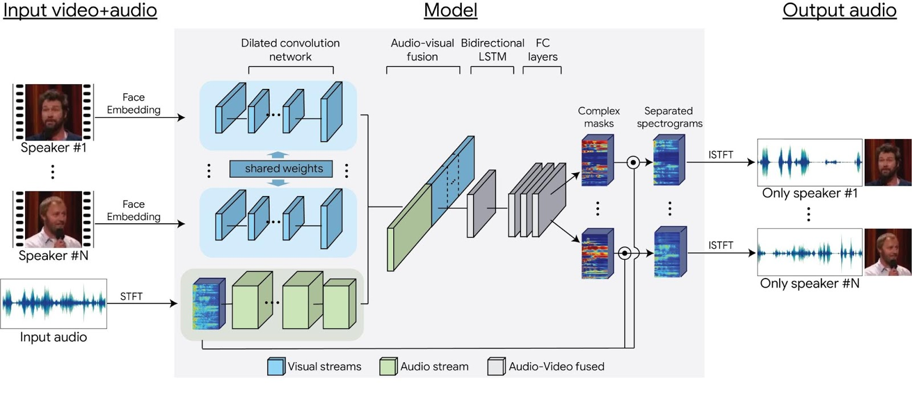

# Looking to Listen at the Cocktail Party

## Overview
Googleにより発表された[Looking to Listen at the Cocktail Party](https://arxiv.org/abs/1804.03619)の実装を試みている。
今までのstate-of-the-artな音源分離の手法では、音源のみの情報を用いた分離が多いが、この提案手法では、動画の情報も用いることで、従来手法よりも
高い精度での音源分離を実現している。また、あらゆる話者の混ざった音声に関して分離が可能となっている。

完成までにはいくつか改良・検討する必要がある。

* GPUへの対応
* バッチサイズへの対応（現在はバッチサイズが１の場合のみに対応）
* Bi-LSTM層についての調査
* ３人以上の話者の混ざった音声の分離
* アウトプットの形

なにかしらのご意見があれば、ぜひとも参考にさせていただきたいと思っております。

## Description
このニューラルネットワークは、動画内の話者の顔情報と、音声情報を使用して学習されている。モデル図は以下のようになる（論文より抜粋）。

はじめは音源のストリームと、動画のストリームに分かれており、それぞれdilated convolution層が配置されている。それぞれのストリームの結果を
結合した後にはBidirectionalLSTM、そして全結合層が続く。
